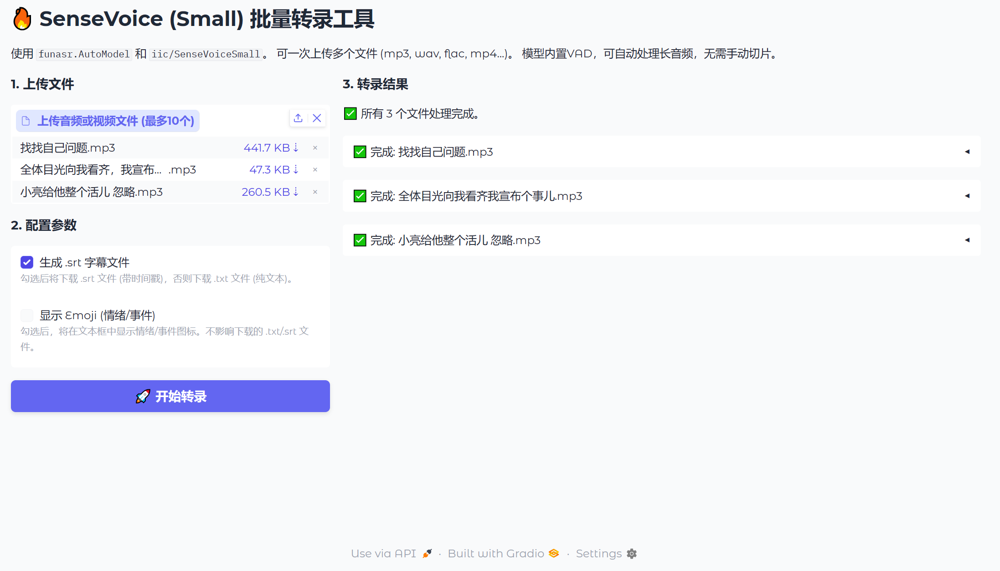

([简体中文](./README.md)|English)

# SenseVoiceBatch

[](https://www.modelscope.cn/models/iic/SenseVoiceSmall/summary)
[](https://github.com/modelscope/FunASR)
[](https://www.gradio.app/)


An audio batch transcription tool (Gradio UI) powered by SenseVoice-Small & FunASR. Features serial multi-file processing, auto VAD, SRT/TXT export, and auto-download.


-----

## ✨ Features

  * **Gradio UI**: Simple and easy-to-use drag-and-drop interface.
  * **Batch Processing**: Process multiple files at once (mp3, wav, flac, mp4...).
  * **Automatic Slicing (VAD)**: Built-in VAD automatically handles long audio, no manual splitting required.
  * **SRT / TXT Export**:
      * `SRT`: Export subtitle files with **precise timestamps**.
      * `TXT`: Export clean, plain text files.
  * **Emoji Toggle**: Freely choose whether to display emotion (😊) and event (🎼) icons in the UI.
  * **Auto-Download**: All outputs (SRT/TXT) are automatically saved to your computer's "Downloads" folder.
  * **One-Click Start**: Includes a `start_asr_app.bat` script for easy launch (Windows users).

## 📦 Installation Guide

This project depends on a Conda environment and the `funasr` library.

**Step 1: Clone the Repository**

```bash
git clone https://github.com/Yiewker/SenseVoiceBatch.git
cd SenseVoiceBatch
```

**Step 2: Create and Activate Conda Environment**

```bash
# (Python 3.9 or 3.10 recommended)
conda create -n sensevoice python=3.10 -y
conda activate sensevoice
```

**Step 3: Install PyTorch**
(CUDA 11.8 is recommended. If your GPU is not supported, please visit the official PyTorch website to find the correct version.)

```bash
# For NVIDIA GPU
pip install torch torchaudio --index-url https://download.pytorch.org/whl/cu118
```

```bash
# For CPU only
pip install torch torchaudio
```

**Step 4: Install Project Dependencies**

```bash
pip install -r requirements.txt
```

## 🚀 How to Run

### Method A: (Recommended - For Windows)

1.  Ensure you have completed all steps in the **Installation Guide** above.
2.  Simply double-click the `start_asr_app.bat` file to run it.

It will automatically activate the `sensevoice` environment, run `app.py`, and open `http://127.0.0.1:7080` in your browser.

### Method B: (Manual - For All Systems)

1.  Open your terminal (or Anaconda Prompt).
2.  Activate the environment:
    ```bash
    conda activate sensevoice
    ```
3.  Run the Web UI:
    ```bash
    python app.py
    ```
4.  Manually open `http://127.0.0.1:7080` in your browser.

## ⚠ Important: Project File Structure

This repository relies on the `model.py` file and the `utils` folder from the original SenseVoice project to run correctly.

**This repository includes a patched `model.py`** that fixes several CUDA and Type bugs from the original version related to timestamp (SRT) generation.

Please ensure your directory structure matches the following, otherwise `app.py` will fail to start due to `remote_code` import errors:

```
SenseVoiceBatch/
│
├── 📄 app.py              <-- Our Gradio interface
├── 📄 model.py            <-- [Important] Patched model definition file
├── 📄 requirements.txt   <-- Dependency list
├── 📄 start_asr_app.bat   <-- [Important] Windows launcher
├── 📄 README.md           <-- (The original Chinese README)
│
└── 📁 utils/              <-- [Important] Original utilities folder
    ├── 📄 ctc_alignment.py
    ├── 📄 frontend.py
    ├── 📄 infer_utils.py
    └── ... (Other utils files)
```

## 🙏 Acknowledgements

  * **FunAudioLLM / SenseVoice (Original Project)**:
      * [https://github.com/FunAudioLLM/SenseVoice](https://github.com/FunAudioLLM/SenseVoice)
  * **FunASR (Core Framework)**:
      * [https://github.com/modelscope/FunASR](https://github.com/modelscope/FunASR)